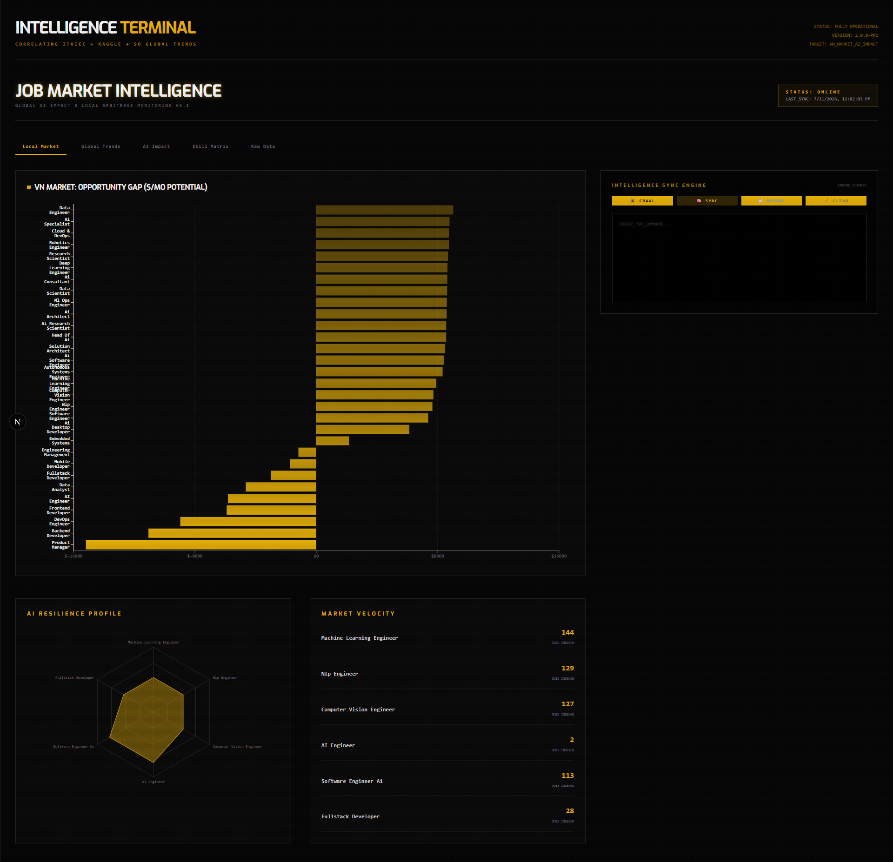
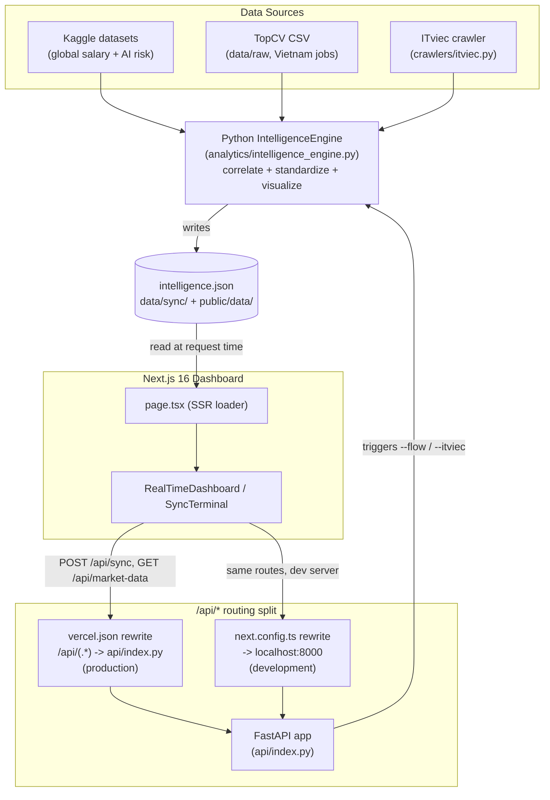
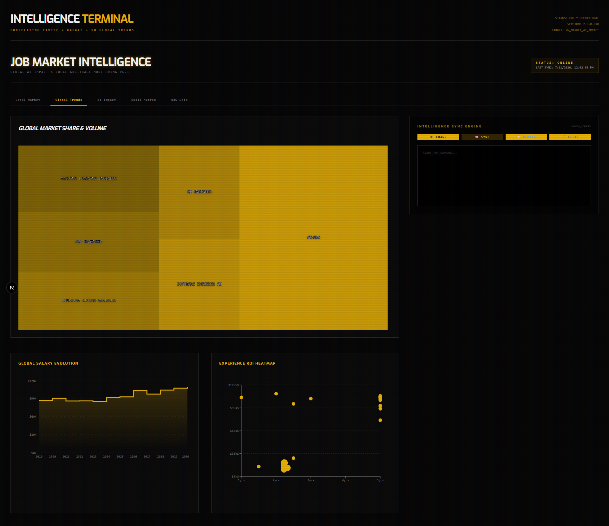

# Job Market Crawler & Skill Analytics

A specialized toolkit to crawl job markets (starting with ITviec) and analyze technology trends. This project helps you identify the most essential skills and tools required for specific roles (e.g., Java Developer) by analyzing real-time job descriptions.



> **Working on the code?** See [SETUP.md](SETUP.md) for quick-start, [AGENTS.md](AGENTS.md) for architecture, [SPEC.md](SPEC.md) for technical details. This README is a product overview.

## Project Structure

```text
job-market-crawler/
├── main.py               # Python CLI entrypoint (argparse)
├── analytics/            # Intelligence engine
│   ├── intelligence_engine.py  # Orchestrator (correlate + export + report)
│   ├── kaggle_unifier.py       # Loads & unifies global Kaggle datasets
│   ├── topcv_parser.py         # Parses local TopCV data
│   ├── standardizer.py         # Title/salary/experience normalization
│   ├── visualizer.py           # Matplotlib chart generation
│   └── kaggle_analyzer.py      # Standalone Kaggle insights suite
├── crawlers/itviec.py    # ITviec scraper (curl-cffi, Cloudflare bypass)
├── config/settings.py    # Paths + Vercel-aware /tmp fallbacks
├── scripts/              # Utilities (dataset extract, benchmarks, SO fetch)
├── api/index.py         # FastAPI bridge (Python serverless / local uvicorn)
├── src/                 # Next.js 16 dashboard
│   ├── app/             #   App Router pages + API routes
│   └── components/      #   React UI (dashboard, terminal, charts)
├── data/                # Input CSVs & generated JSON (gitignored)
├── requirements.txt     # Python dependencies
├── package.json         # Node dependencies
├── AGENTS.md            # Agent orientation guide
└── SPEC.md              # Full technical specification
```

## Architecture

Two runtimes cooperate through a single JSON file — there is no database. The Python engine crawls/loads job data, correlates local (Vietnam) postings against global benchmarks, and writes `intelligence.json`; the Next.js dashboard reads that file and renders it, and can trigger the engine again via its API layer. See [SPEC.md](SPEC.md) for the full data contract and [AGENTS.md](AGENTS.md) for the file-by-file map.



## ✨ Features

- **Dual-source local crawling**: Live ITviec scrape (Backend, Fullstack, Java, Software Engineer queries, curl-cffi + Cloudflare bypass) pooled with a Vietnam TopCV dataset, deduped across both.
- **Skill mining**: Extracts in-demand technologies (Java, Spring Boot, SQL, AWS, .NET/C#, Node.js, React, ...) directly from job titles and descriptions.
- **Global benchmarking**: Correlates the local Vietnam market against global salary/skill data (Kaggle + Stack Overflow 2025 survey) to compute a per-role **Opportunity Gap**, flagging **🚀 High ROI** roles (high global pay, moderate local competition).
- **Real AI-impact risk**: Automation-risk / resilience per role sourced from a real Kaggle AI job-risk dataset, not a heuristic.
- **Advanced extraction**: Regex-based parsing of salaries (USD/VND) and years-of-experience from unstructured job-description text.
- **Visual analytics**: An 8-chart suite — skill ranking, market-share, salary distribution/evolution, AI-impact matrix, skill/experience/salary correlation, and skill co-occurrence network.
- **AI validation & analysis** *(optional)*: Free LLMs (Groq/OpenRouter/Gemini) sanity-check the computed numbers and generate career-strategy insight.
- **Live dashboard**: Next.js frontend renders the same `intelligence.json` the engine exports, with an in-browser terminal to trigger crawls/flows.



## 🔍 What Insight Do You Get?

Running the engine (`--flow`) turns raw job postings into a report that answers three questions:

| Question | How it's answered |
|----------|--------------------|
| **What roles/skills are locally in demand?** | Job-title standardization + skill mining over ITviec + TopCV postings, ranked by mention count and market share. |
| **Is the local market underpaying vs. the world?** | Each role's local salary estimate is compared against the global median (Kaggle + Stack Overflow 2025 survey) to compute an **Opportunity Gap** — the roles with the largest positive gap and real local demand are tagged **🚀 High ROI**. |
| **Which roles are safest from automation?** | Per-role **automation-risk score** from a real Kaggle AI-job-risk dataset, surfaced as a resilience/risk level (e.g. `MODERATE`) alongside the salary numbers. |

Every run produces:
- **`analytics/reports/market_intelligence_*.md`** — an executive summary walking through local demand, global benchmarking, high-ROI/AI-risk strategy, and skill-network connectivity, each backed by a chart.
- **8 charts** (`analytics/reports/*.png`): skill ranking, market-share donut, salary distribution, multi-year salary evolution, AI-impact matrix, skill/experience/salary correlation, skill co-occurrence network.
- **`data/sync/intelligence.json`** (also copied to `public/data/`) — the structured data behind those charts (`intelligence`, `trends`, `impact`, `skills`, `correlation`, `marketShare`, `rawTable`), consumed live by the Next.js dashboard.
- Optionally, **`--ai-analyze`** feeds that JSON to a free LLM (Groq/OpenRouter/Gemini) to sanity-check the numbers and write a career-strategy recommendation.

Because the local side (ITviec + TopCV) is re-crawled data, these numbers change from run to run by design — re-run `python3 main.py --itviec` then `python3 main.py --flow` to get a fresh read, rather than trusting any numbers baked into this doc.

# 🚀 Agentic Job Market Intelligence Engine (v2.0)

A powerful data engine that correlates local job requirements with global industry benchmarks (Stack Overflow 2025) to generate high-ROI career roadmaps. See Features above for the full capability list.

## 🛠 Tech Stack
- **Data**: Pandas, NumPy, Scikit-Learn
- **Visualization**: Matplotlib, Seaborn
- **Crawler**: curl-cffi (Cloudflare Bypass), BeautifulSoup4
- **Intelligence**: Custom correlation engine for market gaps.

## 🚀 Quick Start (3 commands)

### **With Real Kaggle Datasets**
```bash
# 1. Install
pip install -r requirements.txt

# 2. Add your Kaggle API token to .env:  KAGGLE_API_TOKEN=KGAT_xxx
#    (https://www.kaggle.com/settings/account -> Create New API Token)

# 3. Download datasets: Vietnam TopCV (Kaggle) + Stack Overflow survey (global SE benchmark)
python3 main.py --download-datasets
#    (or just the SO survey, no token needed:  python3 main.py --fetch)

# 4. Run analysis
python3 main.py --flow
```

📊 Reports generated in `analytics/reports/` and `data/sync/intelligence.json`

### **With Synthetic Data (Testing)**
```bash
python3 main.py --benchmark     # Generate test data
python3 main.py --flow          # Run analysis
```

### **Dashboard + Backend (Optional)**
```bash
pnpm install

# Run both frontend and backend together
pnpm dev:all    # http://localhost:3000 (frontend) + http://localhost:8000 (API)

# Or run them separately in different terminals:
pnpm dev        # http://localhost:3000 (frontend only)
uvicorn api.index:app --reload --port 8000  # API backend in another terminal
```

---

## 🔧 Development

The full stack consists of two servers:

- **Next.js Frontend** (port 3000): React dashboard that visualizes job market data
- **FastAPI Backend** (port 8000): Python API that serves data and processes intelligence flows

To test features that trigger backend API calls (like `/api/sync` buttons), run both servers together:

```bash
pnpm dev:all    # Starts both servers concurrently
```

If you only need to modify the frontend, `pnpm dev` alone is sufficient.

---

## 📋 Available Commands

| Command | Purpose |
|---------|---------|
| `--download-datasets` | Download real Kaggle datasets (automated) |
| `--flow` | Run full Intelligence Flow (analyze + export + visualize) |
| `--ai-analyze` | Validate + analyze the data with free LLMs (Groq/OpenRouter/Gemini) |
| `--benchmark` | Generate synthetic test data |
| `--extract` | Extract ZIP archives in `data/` to `data/raw/` |
| `--itviec` | Scrape live ITviec jobs (needs credentials) |

### 🤖 AI Validation & Analysis

After running `--flow`, feed the results to free LLMs to sanity-check the numbers and get career-strategy insight:

```bash
python3 main.py --ai-analyze                       # compare all providers with a key
python3 main.py --ai-analyze --provider gemini     # just one
python3 main.py --ai-analyze --profile "Java dev, HCMC, 5y"   # custom profile
```

Set any of `GROQ_API_KEY`, `OPENROUTER_API_KEY`, `GEMINI_API_KEY` in `.env` (all free — see `.env.example` for signup links). Outputs `data/sync/ai_analysis.json` + a readable `analytics/reports/ai_analysis_*.md` comparing each provider side by side.

See [SETUP.md](SETUP.md) for detailed setup instructions and troubleshooting.

## 📊 Outputs
- **`analytics/reports/market_intelligence_*.md`**: Detailed insight report with ROI analysis.
- **`analytics/reports/*.png`**: Visual heatmaps of demand and salary gaps.
- **`outputs/kaggle_reports/`**: Global AI trends, automation risk matrices, and global salary evolution charts.

## 🧠 Intelligence Logic
The system analyzes the **Opportunity Gap** using the following formula:
`Gap = Global_Median_Salary - Local_Estimate`
Skills with the largest positive gap and high local demand are tagged as **🚀 High ROI**.

## Configuration

Set `ITVIEC_SESSION` and `ITVIEC_TOKEN` in `.env` with your ITviec `_ITViec_session` / `auth_token` cookie values for the best results and to avoid 403 errors (see `.env.example`).
